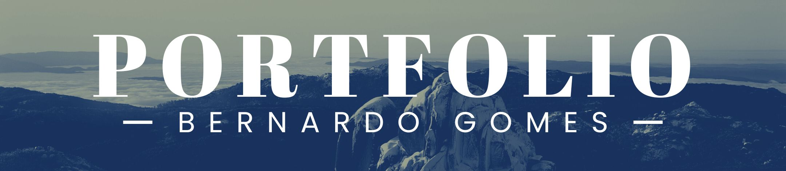

# 🌐 Freebase Portfolio  
### Meu portfólio pessoal hospedado no GitHub Pages  

  

---

## 💼 Sobre mim

Olá! Meu nome é **Bernardo Gomes**, sou apaixonado por tecnologia, dados e criação de soluções que fazem diferença.

---

## 📬 Contato

- 📧 **Email:** [bernardogoems@gmail.com](mailto:bernardogoems@gmail.com)  
- 💼 **LinkedIn:** https://www.linkedin.com/in/bernardo-gomes-356307168/  
- 🧑‍💻 **GitHub:** https://github.com/BernardoGoems  

---

## 📌 Status do Projeto

- 🚀 **Online e funcionando perfeitamente**  
- 🔧 Em constante aprimoramento  
- ✨ Novas seções e melhorias visuais chegando  

---

## 🛠️ Tecnologias Utilizadas

  
  
  
  

---

## 🌍 Acesse o site

👉 **https://bernardogoems.github.io/freebaseportfolio/**

---

## 📁 Estrutura do Projeto

/assets → CSS, scripts e fontes
/images → Imagens utilizadas no site
index.html → Página principal
.github → (Opcional) workflow de deploy

yaml
Copiar código

---

## 🚀 Funcionalidades

- Layout simples, limpo e responsivo  
- Seções:
  - Sobre mim  
  - Habilidades  
  - Serviços  
  - Projetos  
  - Contato  
- Ícones sociais integrados  
- Visual moderno  
- Hospedado gratuitamente via GitHub Pages  

